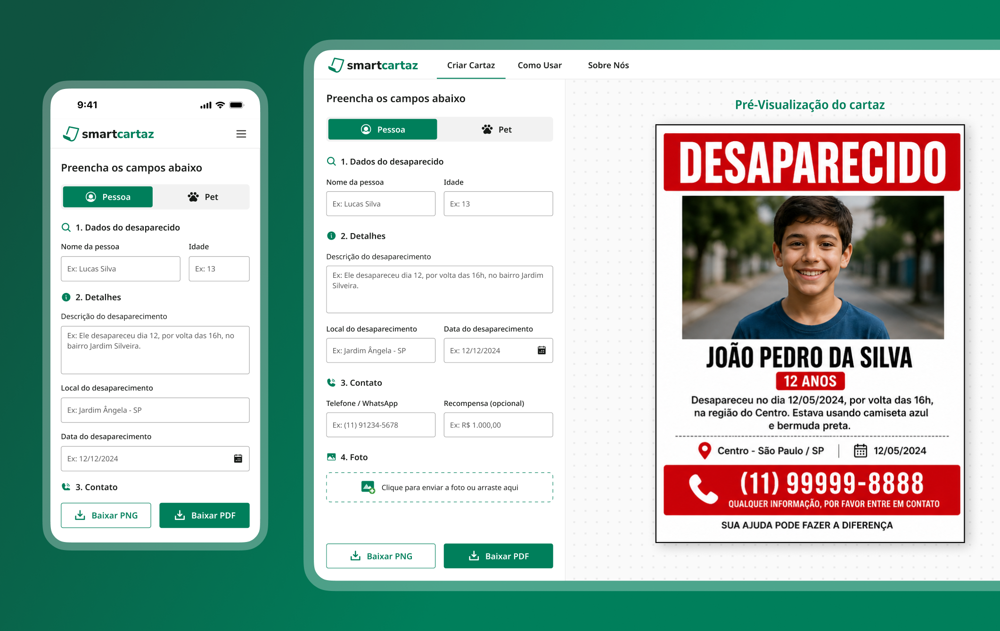

# SmartCartaz
Ferramenta web gratuita e client-side para criação de cartazes de pessoas ou pets desaparecidos. O usuário preenche um formulário (dados do desaparecido, detalhes do desaparecimento, contato, foto), acompanha uma prévia em tempo real do cartaz sendo montado, e baixa o resultado em PNG ou PDF pronto pra imprimir ou compartilhar.

   

## Tabela de Conteúdo

- [Visão Geral](#visão-geral)
  - [Prévia](#prévia)
  - [Link](#link)
  - [Funcionalidades](#funcionalidades)
- [Desenvolvimento](#desenvolvimento)
  - [Tecnologias](#tecnologias)
  - [O que aprendi](#o-que-aprendi)
  - [Desafios](#desafios)
- [Criado por](#criado-por)

## Visão Geral

### Prévia

### Link

- Acesse o SmartCartaz agora: [Clique aqui!](https://smartcartaz.com.br/)

### Funcionalidades
- Formulário dinâmico com formatação automática;
- Prévia do cartaz com atualização em tempo real conforme o formulário é preenchido;
- Controle de zoom manual para visualização em telas menores;
- Exportação do cartaz em PNG ou PDF em A4, com compressão de imagem otimizada.

---

## Desenvolvimento

### Tecnologias

  
  
  
  
  
  
  
  
  
  

### O que aprendi
Desenvolver o SmartCartaz me aproximou de um tema sensível e pouco explorado tecnicamente: o desaparecimento de pessoas e animais. Isso me ensinou a tratar dados de forma responsável, optando por processar tudo no client-side, sem armazenar ou enviar nenhuma informação a servidores, justamente para reduzir a exposição de quem usa a ferramenta em um momento de vulnerabilidade. Também aprendi a pensar UX sob pressão: reduzir etapas, evitar fricção e garantir que o cartaz fique pronto de forma rápida e intuitiva.

No lado técnico, aprofundei JavaScript puro (sem frameworks) para manipulação de DOM em tempo real, integração de bibliotecas externas via CDN (html2canvas para exportação em imagem, jsPDF para geração de PDF) e construção de interfaces responsivas com Flexbox e CSS Grid. Sair da minha zona de conforto, migrando de design gráfico para lógica de aplicação, me deu mais confiança pra debugar problemas de layout e comportamento diretamente em produção.

### Desafios
Integrar bibliotecas externas via CDN (html2canvas e jsPDF) de forma otimizada, sem comprometer performance nem o peso final dos arquivos exportados, incluindo ajustes de compressão de imagem para reduzir o tamanho dos PDFs gerados.

Utilizar ferramentas de IA como apoio no desenvolvimento, mantendo postura crítica: validar cada sugestão, entender o comportamento resultante e revisar possíveis efeitos colaterais antes de aplicar no projeto. Considero essa uma habilidade cada vez mais relevante no mercado atual.

Construir uma experiência verdadeiramente responsiva, indo além dos breakpoints convencionais: identificar e corrigir casos de borda em resoluções intermediárias que normalmente passam despercebidos, garantindo que o layout se adapte de forma fluida em qualquer tamanho de tela.

### Criado por

- Código, projeto e lógica - [Isabelle Nascimento](https://www.linkedin.com/in/isanasc/)
- UI/UX Design - [Felipe Souza](https://www.linkedin.com/in/felipesouza12/)